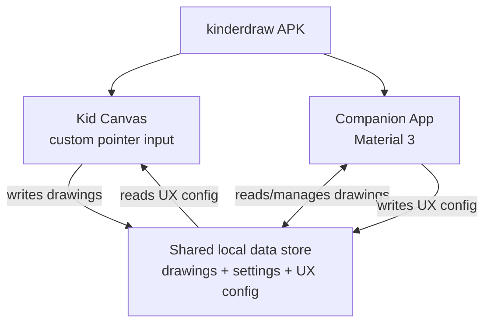

# High-Level Design: kinderdraw

## Problem

Existing toddler drawing apps rely on standard OS/UI click and gesture conventions — precise single taps, long-press for context actions, drag-cancel thresholds — that toddlers cannot reliably perform. The apps tried so far also monetize through ads or paywalls, which is unwanted in a young child's app. And destructive-feeling actions like starting a new picture trigger a standard "Save changes?" confirmation dialog, which interrupts a toddler who doesn't understand the prompt and can't act on it.

## Approach

A native Android app, built in Kotlin with Jetpack Compose, with two screens sharing one local data store:

- **Kid canvas** — the primary drawing surface. Input, including its on-screen controls (color picker, new-picture button, and similar chrome) and not just the drawing surface itself, is read via Compose's raw pointer APIs (`Modifier.pointerInput` / `awaitPointerEventScope`) rather than `clickable()`/Material gesture recognizers, so touch targets, hit-testing, and gesture handling are fully custom-built for toddler motor control: large forgiving targets, no long-press requirement, no accidental double-trigger, no reliance on precise taps. Most drawing apps presumably use raw pointer input for the drawing surface itself; the distinguishing choice here is applying it to the controls too, rather than falling back to standard `clickable()` semantics for buttons.
- **Companion app** — a standard Material 3 Compose screen for parents/caregivers: browsing and managing saved drawings, adjusting settings, and controlling which UX features are active on the kid canvas. Reached via a separate entry point from the kid canvas (its own launcher icon or a distinct in-app path), not a challenge gate. Runs in the same APK and process as the kid canvas, sharing the same on-device data store, so no sync layer is needed between the two.
- **Age-adaptive canvas UX** — the companion app controls which canvas features are enabled, in one of two modes: an age slider that maps to a preset bundle of enabled features appropriate to that age, or a custom mode where a parent toggles each canvas feature on or off individually. The canvas reads this configuration from the shared data store at runtime.

A Linux desktop implementation is planned to follow soon after the Android app. Its companion/settings screen and app shell are planned as native GTK+ (Kotlin/Native), giving that part of the app a genuinely native Linux feel. The kid canvas is implemented via Compose Multiplatform instead: what's shared across Android and Linux (and iOS later) is the logic that turns a touch/pointer sequence into stroke/drawing data — not just business logic like the age-adaptive model — plus painting that data to screen. How a Compose Multiplatform-rendered canvas embeds inside the native GTK+ shell on Linux is an open technical question, deferred to that component's own LLD.

iOS support is a real goal, not currently ruled out, but is blocked for now: building for iOS requires a Mac/Xcode toolchain the team doesn't have access to. When that's resolved, the plan mirrors Linux's split: a native SwiftUI companion app for genuinely native widgets, with the canvas shared via Compose Multiplatform. iOS doesn't package apps as an APK the way Android does (it uses an app bundle/`.ipa` instead), and whether a SwiftUI companion and a Compose Multiplatform canvas can coexist inside one such bundle — and how they'd communicate — is an open technical question, deferred until iOS work actually starts.

Lifecycle actions the toddler can trigger accidentally (starting a new picture, for example) default to a non-interrupting behavior — the current drawing is auto-saved before the canvas clears — rather than surfacing a confirmation dialog the toddler cannot parse or dismiss meaningfully.

## Target Users

- **Toddlers** (roughly ages 2–4) — the primary users of the drawing canvas. Cannot read, cannot reliably perform precise taps or long-presses, need large tolerant touch targets and immediate, forgiving feedback.
- **Parents/caregivers** — secondary users, via the companion screen. Need to browse and manage what their child has drawn, without ads interrupting either screen.

## Goals

- A toddler can draw, change color, and start a new picture without needing an adult's help after a brief demonstration.
- No blocking confirmation dialogs are ever shown on the kid canvas.
- The app is free with no ads, on any platform.
- The companion screen gives a parent standard, familiar native controls (Material 3 on Android, GTK+ on Linux) to review and manage saved drawings.
- A parent can tune which canvas features are active for their child — either by setting an age (mapping to a preset bundle) or by toggling each feature individually in a custom mode.
- The app reaches the Linux desktop soon after the initial Android release, with a native GTK+ companion/shell and a shared Compose Multiplatform canvas. (How the canvas embeds inside the GTK+ shell is still an open technical question — see Approach.)

## Non-Goals

- Web support — not currently planned.
- iOS support in the near term — wanted eventually, but out of scope for now: building for iOS requires a Mac/Xcode toolchain the team doesn't currently have access to.
- A shared cross-platform UI toolkit for companion/shell screens (e.g. Compose Multiplatform for Desktop, Flutter). Each platform's companion screen uses that platform's own native toolkit instead. (This does not apply to the canvas, which is deliberately shared via Compose Multiplatform — see Approach and Tenets.)
- Multiplayer, accounts, or cloud sync.
- Advanced drawing tools (layers, undo history, brush engines) beyond simple freehand strokes and color selection — the canvas is scoped to what a toddler uses.
- Advertising, on any platform.

## Tenets

- **Toddler usability over platform convention, on the canvas.** Where a choice pits toddler-friendly interaction against a platform's standard UI conventions (click ripple, drag thresholds, dismiss-on-outside-tap), the kid canvas leans toward toddler usability, on every platform. The companion screen leans the opposite way — it follows each platform's native conventions (Material 3 on Android, GTK+ HIG on Linux), since parents benefit from platform familiarity rather than custom affordances.
- **Reversible actions default to forgiving, not confirmed.** An action the toddler can trigger by accident defaults to a non-blocking, recoverable behavior (auto-save-then-clear) rather than a confirmation prompt, as long as the action is actually recoverable. A genuinely irreversible, high-consequence action would still warrant a different treatment.
- **Free and open-source.** kinderdraw is free and open-source software — ads are never on the table as a monetization trade-off, even when they'd be the simpler or more conventional build choice. Source is publicly available under an open license.
- **Each platform's companion/shell UI uses that platform's own native toolkit, not a shared cross-platform rendering layer.** Android's companion screen ships Material 3; Linux's ships GTK+. This costs a duplicate implementation per platform instead of one shared codebase — accepted in exchange for that screen feeling native. The kid canvas is a deliberate exception: it's already a custom, non-native-widget UI on every platform by design (see the toddler-usability tenet above), so sharing the logic that turns a touch sequence into a drawing — and its on-screen painting — across platforms via Compose Multiplatform doesn't cost the same native-feel trade-off this tenet protects.

## System Design

One Android app module. Two separate entry points — the kid canvas and the companion app are reached independently (not one gated behind the other) — sharing one local on-device data store in-process. That store holds saved drawings, app settings, and the current UX configuration (age-slider value or custom per-feature toggle state) that the companion app writes and the canvas reads to determine which features are active.

The diagram above covers the initial Android build. The planned Linux app (see Approach) is a separate application with its own local data store and a native GTK+ companion/shell, kept behaviorally consistent with the Android companion app via shared EARS specs. Its canvas, unlike its companion/shell, is the same Compose Multiplatform implementation as Android's — shared code, not just shared specs. How that shared canvas embeds inside the native GTK+ shell is an open technical question, not yet resolved.

## Key Design Decisions

- **Kotlin + Jetpack Compose, over Godot and Flutter.** Godot was ruled out: as a game engine, its Control-node UI system has no built-in Material Design implementation, so the companion screen would require either hand-built Material-alike widgets or bridging to an embedded native Android view — real, ongoing engineering cost for a screen that should just be standard Material. Flutter was ruled out: it would require learning a new language and framework (Dart/Flutter's widget-and-State model) from scratch, with no offsetting benefit while Android is the only target platform. Compose was chosen because it gives full raw-pointer input control (the same fidelity needed to build the custom kid canvas), Material 3 is its native design system (making the companion screen close to free), and it builds on existing Kotlin/Compose experience. Cross-platform reach, if it becomes a real requirement later, is deferred to a possible second implementation rather than driving the initial framework choice.
- **One shared local data store, not two.** The canvas and companion screen run in the same process and read/write the same on-device store, avoiding any sync mechanism between them.
- **Age-adaptive canvas, tunable from the companion app, over a single fixed UX.** Toddlers span a wide developmental range (roughly 2–4), so one fixed feature set risks being too complex for the youngest or too limited for the oldest. An age slider gives a fast, low-effort default; a custom per-feature toggle mode is the escape hatch for a parent who wants finer control than the age presets give.
- **Kotlin/Native + GTK+ for the Linux companion/shell, native toolkit per platform for companion screens generally.** For a screen that just needs standard native controls (browsing drawings, settings), a genuinely native GTK feel was judged worth a separate implementation: window chrome, theming, and widget behavior under Compose Multiplatform would be Compose's own rather than the desktop's. This choice is scoped to the companion/shell UI, not the canvas.
- **Canvas implemented once via Compose Multiplatform, shared across platforms.** The canvas's job is converting a touch/pointer sequence into stroke data and painting it — not presenting native platform widgets — so there's no native-feel cost to sharing it, unlike the companion screen. This is shared code, not just specs kept in sync by convention. Embedding the shared canvas inside the native GTK+ companion shell on Linux is an open technical question, not yet verified feasible, and is deferred to the canvas component's own LLD.

## Success Metrics

- A toddler can operate the primary actions (draw, change color, start a new picture) without an adult's intervention, after a brief demonstration.
- No ads, purchase prompts, or blocking confirmation dialogs ever appear on the kid canvas.
- If usability observation shows a toddler getting stuck, needing help, or accidentally losing work on the canvas, the relevant interaction is considered broken and revisited.

## References

- License: MIT.
