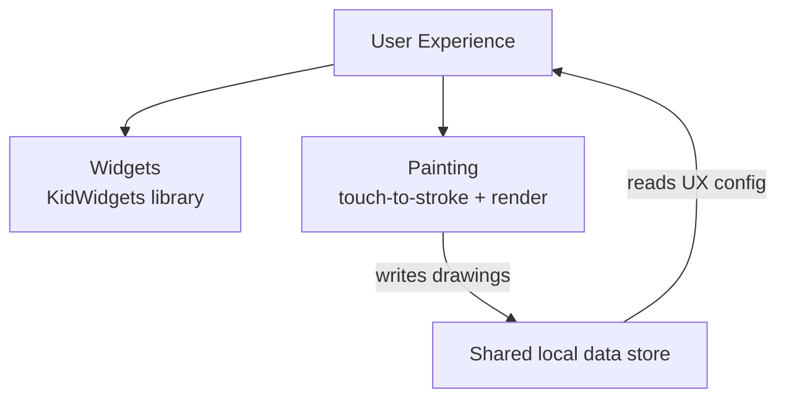

# Kid Canvas

## Problem

The primary drawing surface can't use standard platform UI conventions anywhere on screen — not just on the drawing area itself, but on its own controls (color picker, new-picture button, and similar chrome). That single constraint splits into three distinct engineering problems that don't share an implementation: how an individual on-screen control reads raw pointer input and decides it's been activated, how the screen as a whole is composed and behaves (what's on screen, when, and how it responds to configuration), and how a pointer/touch sequence becomes a rendered stroke on the drawing surface. Each is a different kind of problem — input-handling primitives, screen composition and behavior, and drawing/rendering — with different state, different failure modes, and different testing concerns, so each gets its own LLD. This document holds the intent that's shared across all three: the toddler-usability constraint and how the three fit together.

## Approach

Kid Canvas is composed of three components:

- **Widgets** — implements the KidWidgets library: raw-pointer-driven controls (buttons, color picker, and similar chrome) that replace `clickable()`/Material gesture recognizers, so hit-testing and activation are fully custom-built for toddler motor control.
- **User Experience** — composes Widgets into the on-screen chrome and hosts Painting as the drawing surface; owns overall screen behavior — which features are active (read from the shared UX config), non-interrupting lifecycle behavior (auto-save-then-clear on a new picture), and interaction feedback.
- **Painting** — converts a pointer/touch sequence into stroke data and renders it to the drawing surface.

User Experience is the composition root: it's the only component that depends on both of the others. Widgets and Painting don't depend on each other.

## System Design

## Key Design Decisions

| Decision | Chosen | Alternatives Considered | Rationale |
|----------|--------|------------------------|-----------|
| How to split Kid Canvas's intent | Promote to a sub-HLD over three leaf LLDs (Widgets, User Experience, Painting) | One flat leaf LLD covering all of Kid Canvas; three unrelated top-level LLDs with no parent doc | The three parts are distinct engineering concerns (input primitives, screen composition/behavior, rendering) that don't share an implementation, so a single leaf would mix unrelated specs. But they share real parent intent — the toddler-usability constraint applies to all three, and something has to own how User Experience composes the other two — so a parent doc carries real content rather than being a table of contents. |

## References

- Root HLD: `docs/high-level-design.md` — Target Users, the toddler-usability-over-convention tenet this subtree exists to serve, and the decision to share Kid Canvas across platforms via Compose Multiplatform.
