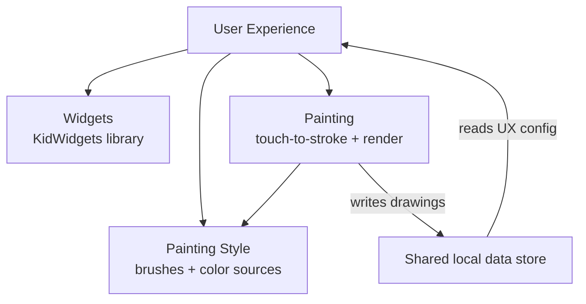

# Kid Canvas

## Problem

The primary drawing surface can't use standard platform UI conventions anywhere on screen — not just on the drawing area itself, but on its own controls (color picker, new-picture button, and similar chrome). That single constraint splits into four distinct engineering problems that don't share an implementation: how an individual on-screen control reads raw pointer input and decides it's been activated, how the screen as a whole is composed and behaves (what's on screen, when, and how it responds to configuration), how a pointer/touch sequence becomes a rendered stroke on the drawing surface, and what a stroke or the canvas background actually looks like — its shape and coloring, as opposed to the mechanics of capturing or displaying it. Each is a different kind of problem — input-handling primitives, screen composition and behavior, stroke-capture/rendering, and visual styling — with different state, different failure modes, and different testing concerns, so each gets its own LLD. This document holds the intent that's shared across all four: the toddler-usability constraint and how the four fit together.

## Approach

Kid Canvas is composed of four components:

- **Widgets** — implements the KidWidgets library: raw-pointer-driven controls (buttons, color picker, and similar chrome) that replace `clickable()`/Material gesture recognizers, so hit-testing and activation are fully custom-built for toddler motor control.
- **User Experience** — composes Widgets into the on-screen chrome and hosts Painting as the drawing surface; owns overall screen behavior — which features are active (read from the shared UX config), non-interrupting lifecycle behavior (auto-save-then-clear on a new picture), and interaction feedback.
- **Painting** — converts a pointer/touch sequence into stroke data and renders it to the drawing surface, delegating a stroke's actual visual rendering to a Painting Style brush.
- **Painting Style** — defines what a stroke or the canvas background looks like: pluggable brush shapes, and color sources (fixed or algorithmically varied) that produce the colors a brush or background renders with.

User Experience is the composition root: it composes Widgets and hosts Painting, and is the only component that depends on both. Painting depends on Painting Style for its brush/stroke rendering strategy; User Experience depends on Painting Style for the color sources behind Active Stroke Settings. Painting Style depends on none of the other three, and Widgets and Painting don't depend on each other.

## System Design

```mermaid
graph TD
    UX[User Experience]
    Widgets[Widgets<br/>KidWidgets library]
    Painting[Painting<br/>touch-to-stroke + render]
    Style[Painting Style<br/>brushes + color sources]
    Store[Shared local data store]

    UX --> Widgets
    UX --> Painting
    UX --> Style
    Painting --> Style
    Store -- reads UX config --> UX
    Painting -- writes drawings --> Store
```

## Key Design Decisions

| Decision | Chosen | Alternatives Considered | Rationale |
|----------|--------|------------------------|-----------|
| How to split Kid Canvas's intent | Promote to a sub-HLD over four leaf LLDs (Widgets, User Experience, Painting, Painting Style) | One flat leaf LLD covering all of Kid Canvas; four unrelated top-level LLDs with no parent doc | The four parts are distinct engineering concerns (input primitives, screen composition/behavior, stroke-capture/rendering, visual styling) that don't share an implementation, so a single leaf would mix unrelated specs. But they share real parent intent — the toddler-usability constraint applies to all four, and something has to own how User Experience composes the others — so a parent doc carries real content rather than being a table of contents. |
| Splitting brush/color out of Painting and User Experience into its own leaf | Painting Style, a new sibling leaf that Painting and User Experience both depend on | Leave brush shape internal to Painting (as before) and color-source logic internal to User Experience's Active Stroke Settings implementation | Brush shape and coloring were already growing beyond a one-off implementation detail — multiple brush types and multiple color-source strategies (constant, algorithmically randomized) are an explicit near-term goal — and the two were artificially split across two unrelated components (Painting owned brush shape, User Experience owned color) despite being the same underlying concern: what a stroke looks like. A dedicated leaf gives that concern one home before the catalog grows further. |

## References

- Root HLD: `docs/high-level-design.md` — Target Users, the toddler-usability-over-convention tenet this subtree exists to serve, and the decision to share Kid Canvas across platforms via Compose Multiplatform.
